# Birthday API - System Architecture

## Overview

This document describes the complete system architecture for the Birthday API deployed on Google Cloud Platform (GCP) using Kubernetes.
Please note that it was generated based on the actual code from this repository.

## System Diagram

```mermaid
graph TB
    %% External Components
    Internet[🌐 Internet]
    User[👤 User]

    %% GCP Infrastructure
    subgraph "Google Cloud Platform"
        subgraph "VPC Network (birthday-api-vpc)"
            subgraph "GKE Cluster (birthday-api-cluster)"
                subgraph "Namespace: birthday-api"
                    Pod1[📦 Birthday API Pod 1]
                    Pod2[📦 Birthday API Pod 2]
                    HPA[HPA Controller]
                end

                subgraph "Namespace: external-secrets"
                    ESO[🔐 External Secrets Operator]
                    ESO_SA[Service Account: external-secrets]
                end

                subgraph "Namespace: kube-prometheus-stack"
                    Prometheus[📊 Prometheus]
                    Grafana[📈 Grafana]
                    AlertManager[🚨 AlertManager]
                end
            end

            subgraph "Cloud SQL"
                DB[(🗄️ PostgreSQL Database<br/>birthday-api-sql)]
            end
        end

        subgraph "GCP Services"
            SecretManager[🔑 Secret Manager]
            ArtifactRegistry[📦 Artifact Registry]
            NAT[🌐 NAT Gateway]
            Router[🛣️ Cloud Router]
        end

        subgraph "IAM & Service Accounts"
            GKE_SA[Service Account: birthday-api-gke-sa]
            ESO_GSA[Service Account: birthday-api-eso-sa]
            Registry_SA[Service Account: birthday-api-registry-sa]
        end
    end

    %% Terraform & Helm
    subgraph "Infrastructure as Code"
        Terraform[🏗️ Terraform]
        Helm[⚓ Helm Charts]
        DeployScript[📜 deploy-infrastructure.sh]
    end

    %% Connections
    %% User access
    User --> Internet
    Internet --> Pod1
    Internet --> Pod2

    %% Pod connections
    Pod1 --> DB
    Pod2 --> DB
    Pod1 --> ESO
    Pod2 --> ESO

    %% External Secrets
    ESO --> SecretManager
    ESO_SA --> ESO_GSA

    %% Monitoring
    Pod1 --> Prometheus
    Pod2 --> Prometheus
    Prometheus --> Grafana
    Prometheus --> AlertManager

    %% Infrastructure
    Terraform --> GKE_SA
    Terraform --> ESO_GSA
    Terraform --> Registry_SA
    Terraform --> DB
    Terraform --> SecretManager
    Terraform --> ArtifactRegistry
    Terraform --> NAT
    Terraform --> Router

    %% Deployment
    DeployScript --> Helm
    Helm --> Pod1
    Helm --> Pod2
    Helm --> ESO
    Helm --> Prometheus
    Helm --> Grafana

    %% Network
    NAT --> Internet
    Router --> NAT

    %% Registry
    ArtifactRegistry --> Pod1
    ArtifactRegistry --> Pod2

    %% Styling
    classDef gcp fill:#4285f4,stroke:#333,stroke-width:2px,color:#fff
    classDef k8s fill:#326ce5,stroke:#333,stroke-width:2px,color:#fff
    classDef security fill:#ea4335,stroke:#333,stroke-width:2px,color:#fff
    classDef monitoring fill:#34a853,stroke:#333,stroke-width:2px,color:#fff
    classDef infra fill:#fbbc04,stroke:#333,stroke-width:2px,color:#000

    class SecretManager,ESO_GSA,GKE_SA,Registry_SA security
    class Prometheus,Grafana,AlertManager monitoring
    class Terraform,Helm,DeployScript infra
    class Pod1,Pod2,ESO,HPA k8s
    class DB,ArtifactRegistry,NAT,Router gcp
```



## Component Details

### 🏗️ Infrastructure Layer (Terraform)

**VPC & Networking:**

- **VPC**: `birthday-api-vpc` with private subnets
- **NAT Gateway**: Enables private nodes to access internet
- **Cloud Router**: Routes traffic through NAT
- **Firewall Rules**: Secure pod-to-pod communication

**GKE Cluster:**

- **Cluster**: `birthday-api-cluster` in `europe-west4`
- **Node Pool**: Private nodes with Workload Identity enabled
- **Network Policy**: Disabled to avoid connectivity issues

**Cloud SQL:**

- **Instance**: `birthday-api-sql` (PostgreSQL 15)
- **Network**: Private VPC with no public IP
- **Database**: `birthday_api`
- **User**: `birthday_user` with auto-generated password

**Service Accounts:**

- **GKE SA**: `birthday-api-gke-sa` (for nodes and pods)
- **ESO SA**: `birthday-api-eso-sa` (for External Secrets)
- **Registry SA**: `birthday-api-registry-sa` (for Artifact Registry)

**Secret Manager:**

- **Secrets**: Database password, secret key, Grafana password
- **Access**: Controlled via IAM roles

### 🐳 Application Layer (Kubernetes)

**Namespaces:**

- **birthday-api**: Main application
- **external-secrets**: External Secrets Operator
- **kube-prometheus-stack**: Monitoring stack

**Birthday API Pods:**

- **Replicas**: 1-2 (autoscaled)
- **Resources**: 50m CPU, 64Mi memory (requests)
- **Sidecar**: Cloud SQL Auth Proxy
- **Service Account**: `birthday-api-sa` with Workload Identity
- **Init Container**: Database migration runner (checks and applies Alembic migrations)

**External Secrets:**

- **Operator**: Manages secret synchronization
- **SecretStore**: ClusterSecretStore for GCP Secret Manager
- **ExternalSecret**: Fetches secrets from Secret Manager

**Monitoring Stack:**

- **Prometheus**: Metrics collection
- **Grafana**: Dashboards and visualization
- **AlertManager**: Alert management
- **ServiceMonitors**: Auto-discovery of services

### 🔐 Security Layer

**Workload Identity:**

- Pods authenticate as GCP service accounts
- No service account keys needed
- Secure token-based authentication

**Network Security:**

- Private VPC with no public endpoints
- Firewall rules for pod communication
- Cloud SQL with private IP only

**Secret Management:**

- Secrets stored in GCP Secret Manager
- External Secrets Operator syncs to Kubernetes
- No secrets in Helm charts or code

### 📊 Monitoring & Observability

**Metrics Collection:**

- Prometheus scrapes application metrics
- Custom ServiceMonitors for birthday-api
- Node and cluster metrics

**Visualization:**

- Grafana dashboards
- Pre-configured monitoring panels
- Custom application metrics

**Alerting:**

- AlertManager for notifications
- PrometheusRules for alert conditions
- Integration with monitoring stack

## Data Flow

### 1. Application Startup


### 2. Secret Management


### 3. Monitoring


## Deployment Process

### 1. Infrastructure Setup

```bash
cd terraform
terraform init
terraform plan
terraform apply
```

### 2. Application Deployment

```bash
./scripts/deploy-infrastructure.sh deploy
```

**Deployment Steps:**

1. Build and push Docker image to Artifact Registry
2. Install External Secrets Operator
3. Wait for CRDs to be available
4. Deploy application with database migration init container
5. Init container runs database migrations before app starts
6. Configure Grafana with secrets

## Security Features

- ✅ **Private VPC**: All resources in private network
- ✅ **Workload Identity**: Secure service account authentication
- ✅ **Secret Management**: No secrets in code or charts
- ✅ **Network Policies**: Controlled pod communication
- ✅ **Private Cloud SQL**: No public IP access
- ✅ **IAM Roles**: Least privilege access

## Scalability Features

- ✅ **Horizontal Pod Autoscaler**: Auto-scale based on CPU/memory
- ✅ **GKE Autoscaling**: Node pool auto-scaling
- ✅ **Database Connection Pooling**: Efficient database connections
- ✅ **Load Balancing**: GKE ingress controller

## Monitoring Features

- ✅ **Application Metrics**: Custom birthday-api metrics
- ✅ **Infrastructure Metrics**: Node and cluster monitoring
- ✅ **Database Monitoring**: Cloud SQL metrics
- ✅ **Alerting**: Configurable alert rules
- ✅ **Dashboards**: Pre-configured Grafana dashboards

## Cost Optimization

- ✅ **Resource Limits**: Proper CPU/memory requests/limits
- ✅ **Autoscaling**: Scale down during low usage
- ✅ **Private Nodes**: Reduced egress costs
- ✅ **Efficient Storage**: Optimized database configuration
